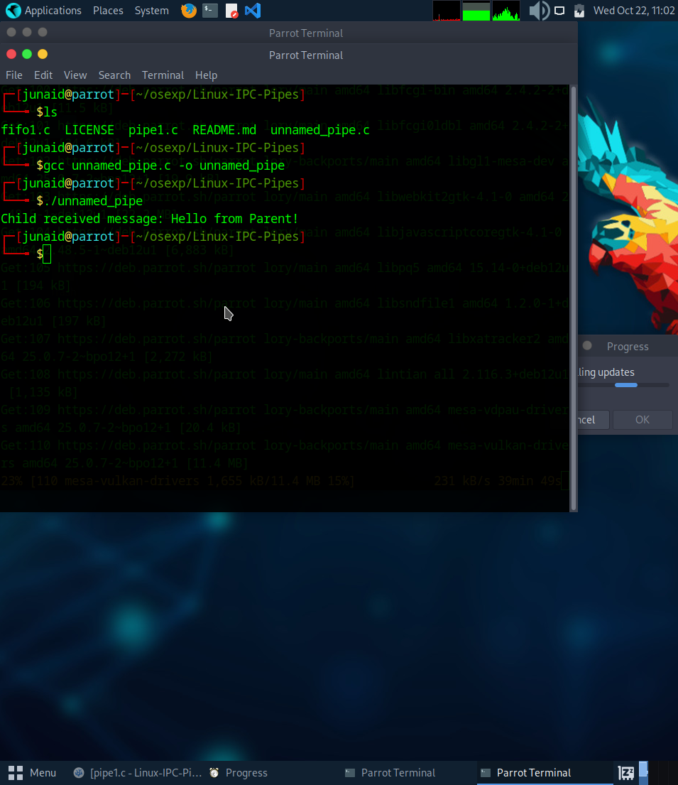
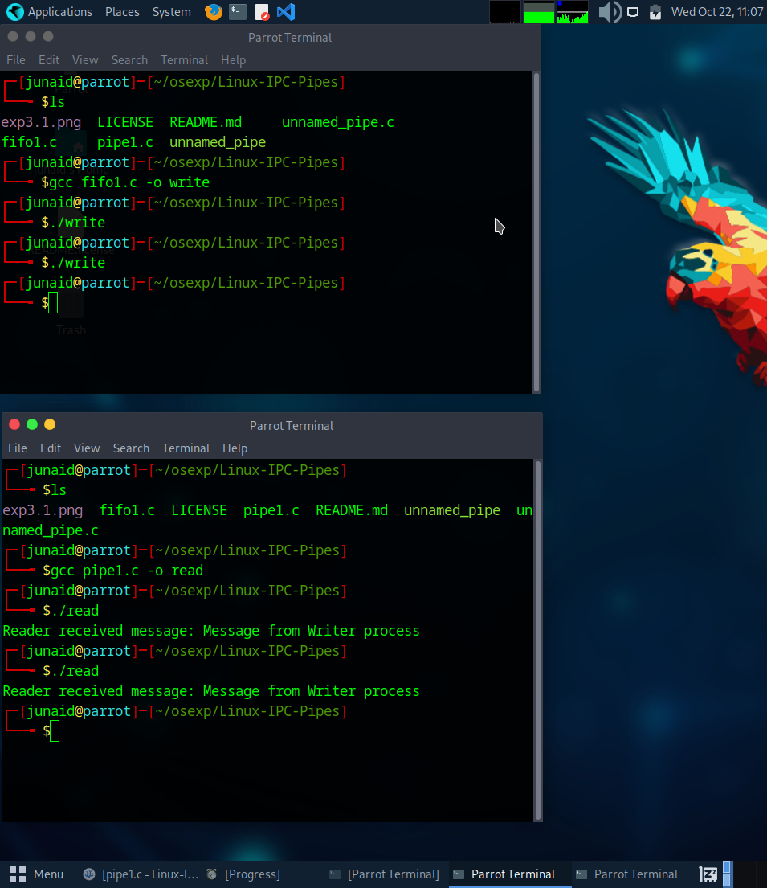

# Linux-IPC--Pipes
Linux-IPC-Pipes


# Ex03-Linux IPC - Pipes

# AIM:
To write a C program that illustrate communication between two process using unnamed and named pipes

# DESIGN STEPS:

### Step 1:

Navigate to any Linux environment installed on the system or installed inside a virtual environment like virtual box/vmware or online linux JSLinux (https://bellard.org/jslinux/vm.html?url=alpine-x86.cfg&mem=192) or docker.

### Step 2:

Write the C Program using Linux Process API - pipe(), fifo()

### Step 3:

Testing the C Program for the desired output. 

# PROGRAM:

## C Program that illustrate communication between two process using unnamed pipes using Linux API system calls

```
#include <stdio.h>
#include <unistd.h>
#include <string.h>

int main() {
    int fd[2];
    pid_t pid;
    char write_msg[] = "Hello from Parent!";
    char read_msg[100];

    // Create a pipe
    if (pipe(fd) == -1) {
        perror("Pipe failed");
        return 1;
    }

    pid = fork(); // Create a child process

    if (pid < 0) {
        perror("Fork failed");
        return 1;
    }

    if (pid > 0) {  
        // Parent process
        close(fd[0]); // Close unused read end
        write(fd[1], write_msg, strlen(write_msg) + 1);
        close(fd[1]); // Close write end after writing
    } else {  
        // Child process
        close(fd[1]); // Close unused write end
        read(fd[0], read_msg, sizeof(read_msg));
        printf("Child received message: %s\n", read_msg);
        close(fd[0]);
    }

    return 0;
}
```

## OUTPUT


## C Program that illustrate communication between two process using named pipes using Linux API system calls

```
write = fifo1.c
#include <stdio.h>
#include <fcntl.h>
#include <sys/stat.h>
#include <unistd.h>
#include <string.h>

int main() {
    int fd;
    char *fifo_path = "/tmp/myfifo";
    char write_msg[] = "Message from Writer process";

    // Create FIFO if it doesn’t exist
    mkfifo(fifo_path, 0666);

    fd = open(fifo_path, O_WRONLY);
    write(fd, write_msg, strlen(write_msg) + 1);
    close(fd);

    return 0;
}

read = pipe1.c
#include <stdio.h>
#include <fcntl.h>
#include <sys/stat.h>
#include <unistd.h>

int main() {
    int fd;
    char *fifo_path = "/tmp/myfifo";
    char read_msg[100];

    mkfifo(fifo_path, 0666);

    fd = open(fifo_path, O_RDONLY);
    read(fd, read_msg, sizeof(read_msg));
    printf("Reader received message: %s\n", read_msg);
    close(fd);

    return 0;
}
```

## OUTPUT


# RESULT:
The program is executed successfully.
